# FoodExpress - Food Retailer

## Targeting Customers for Marketing Stragery

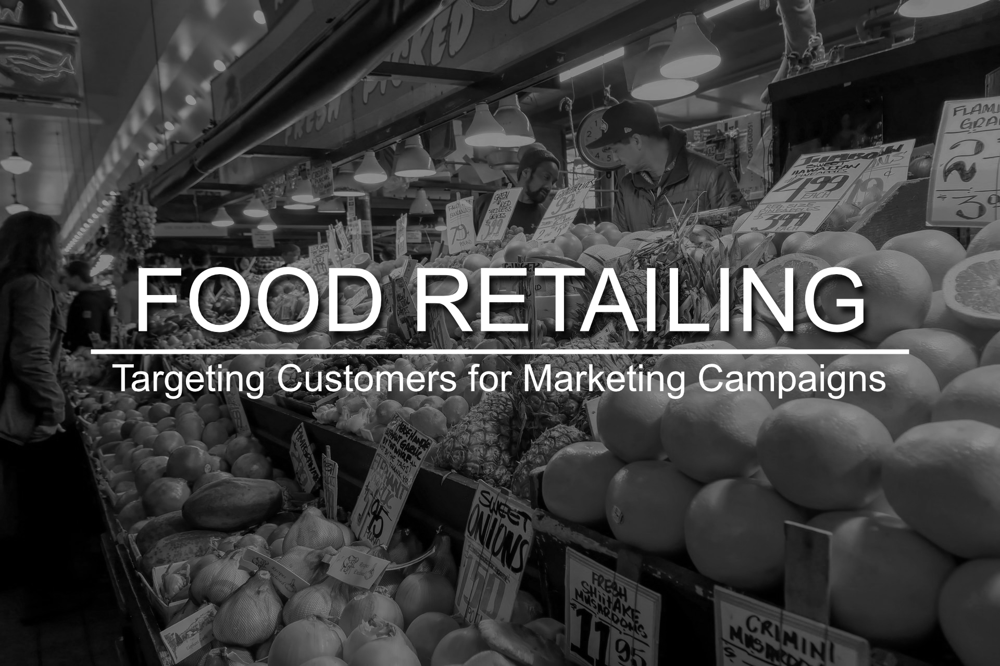

Photo by <a href="https://unsplash.com/@jesseapaul?utm_source=unsplash&amp;utm_medium=referral&amp;utm_content=creditCopyText">Jesse Paul</a> on <a href="https://unsplash.com/s/photos/market?utm_source=unsplash&amp;utm_medium=referral&amp;utm_content=creditCopyText">Unsplash</a>

# 1.0 The context

## 1.1 What Digital Marketing?

At a high level, digital marketing refers to advertising delivered through digital channels such as search engines, websites, social media, email, and mobile apps. Using these online media channels, digital marketing is the method by which companies endorse goods, services, and brands. Consumers heavily rely on digital means to research products. For example, Think with Google marketing insights found that 48% of consumers start their inquiries on search engines, while 33% look to brand websites and 26% search within mobile applications. Email marketing, pay-per-click advertising, social media marketing and even blogging are all great examples of digital marketing—they help introduce people to your company and convince them to buy.

## 1.2 What is Conversion Rate?

To put it simply, your conversion rate is the percentage of visitors to your website or landing page that convert (aka, do what you want them to do). Depending on your business goals, a “conversion” could be almost anything, but here are a few common types of conversions:

- Making a purchase
- Submitting a form (contact us form, lead gen form, etc)
- Calling your business
- Engaging with your online chat
- Signing up for a subscription (either paid or free—like a newsletter)
- Registering on the site
- Downloading something (software trial, eBook, mobile app, etc)
- Using something (new/advanced feature on your software or app, simply using your software/app for a certain amount of time)
- Upgrading their service
- Engaging with your site in some way (time on site, repeat visits, number of pages visited)

There are plenty of other conversion actions people can take on a site, but this should give you a feel for what a “conversion” is. Basically, a conversion is a measurable action that progresses a potential customer towards becoming a paying customer in an important way.

PS 1: All the references are stated at the end of this README.

PS 2: You can find useful information at **section 1** of my [notebook](https://github.com/brunokatekawa/food_retail_classification/blob/main/01_iFood_Customer_Classification.ipynb).

 

# 2.0 The challenges

FoodExpress is a well-established company operating in the retail food sector. Presently they have around several hundred thousand registered customers and serve almost one million consumers a year. They sell products from 5 major categories: wines, rare meat products, exotic fruits, specially prepared fish and sweet products. These can further be divided into gold and regular products. The customers can order and acquire products through 3 sales channels: physical stores, catalogs and company’s website. Globally, the company had solid revenues and a healthy bottom line in the past 3 years, but the profit growth perspectives for the next 3 years are not promising... For this reason, several strategic initiatives are being considered to invert this situation. One is to improve the performance of marketing activities, with a special focus on marketing campaigns.

### The objective

**The objective of the team is to build a predictive model that will produce the highest profit for the next direct marketing campaign, scheduled for the next month.** The new campaign, sixth, aims at selling a new gadget to the Customer Database. To build the model, a pilot campaign involving 2.240 customers was carried out. The customers were selected at random and contacted by phone regarding the acquisition of the gadget. During the following months, customers who bought the offer were properly labeled. The total cost of the sample campaign was 6.720MU and the revenue generated by the customers who accepted the offer was 3.674MU. Globally the campaign had a profit of -3.046MU. The success rate of the campaign was 15%. The objective is of the team is to develop a model that predicts customer behavior and to apply it to the rest of the customer base. Hopefully, **the model will allow the company to cherry pick the customers that are most likely to purchase the offer while leaving out the non-respondents**, making the next campaign highly profitable. Moreover, other than maximizing the profit of the campaign, the CMO is interested in understanding to **study the characteristic features of those customers who are willing to buy the gadget**.

For the data set and more info about the case [click here](https://github.com/ifood/ifood-data-business-analyst-test).

 

# 3.0 The solution

In this project, I managed to address a solution by developing **a web app that runs a classification model** by intaking a portfolio of target customers (.csv file), a medium cost value and a threshold parameter. The web app **builds a spreadsheet and calculates the total revenue expected** for those customers that converted in the marketing campaign. **The user can check the revenue value and download the spreadsheet** that allows the company to cherry pick the customers that are most likely to purchase the offer while leaving out the non-respondents.

Check it live here: https://foodexpress-classification-bk.herokuapp.com/

**OBS: It may take a while to load the app, because I'm using the free tier of Heroku and in this tier app hibernate after 30 min of inactivity.**

 

## 3.1 What drove the solution

### 3.1.1 Exploratory Data Analysis

#### Descriptive Analysis

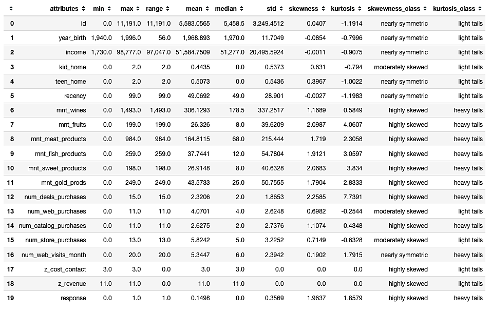

Key points:

- The **oldest** person was born in **1940**.
- The **youngest** person was born in **1996**.
- The **average income is $51,596.39**.
- People have at **maximum 2 kids** at home.
- People have at **maximum 2 teens** at home.
- The **average recency is 49 days** while the maximum is 99 days.

 

#### Hypothesis Map

This map to help us to decide which variables we need in order to validate the hypotheses.

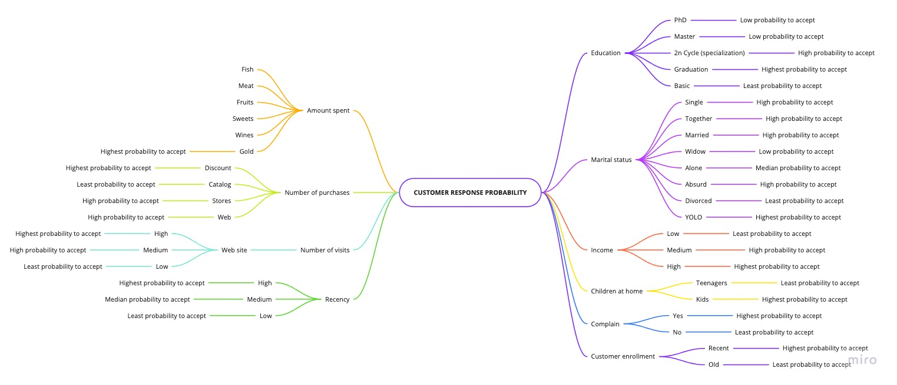

#### Univariate Analysis - Responses (target)

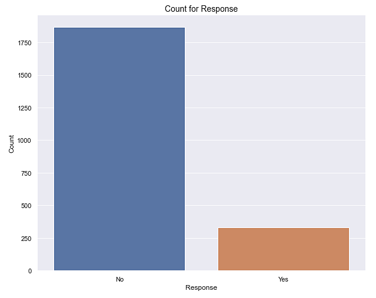

Number of yes: 329 (14.98% of the total responses)
Number of no: 1867 (85.01% of the total responses)

 

#### Univariate Analysis - Numerical

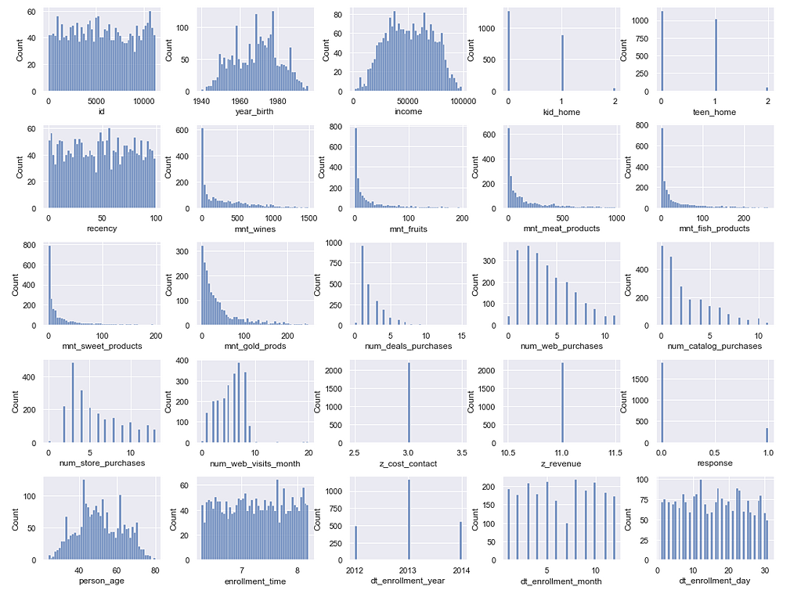

Key points:

- Most people were born between 1960 and 1980.
- Most people have income between 25k and 75k.
- Almost no one have kids neither teenagers at home.
- There are all sorts of recency.
- Big portion of people spend up to:
  - 500 on wine
  - 250 on meat
  - 50 on fruits
  - 50 on fish
  - 50 on fruits
  - 75 on gold products
- Big portion of people make purchases up to:
  - 5 with discount
  - 7 through company's web site
  - 6 using catalog
  - 7 directly in stores
- 5 to 10 visits to company's website were the number that most people made.
- Most people enrolled on 2013.
- July is the month with least enrollments.

 

#### Univariate Analysis - Categorical

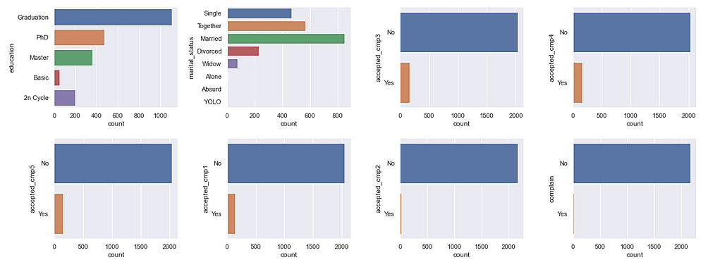

Key points:

- There more people holding a graduate degree.
- There are more people that are married.
- The big majority of people tend to not accept the offer.

 

### 3.1.2 Hypothesis validation - Bivariate Analysis

#### Main Hypothesis

##### H1 People with graduate degree tend to accept more. (TRUE)

##### H2 People with basic degree tend to be the least to accept. (TRUE)

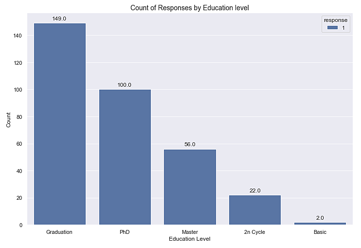

As observed, people with graduate degree tend to accept more while people with basic degree tend to be the least to accept.

> Thus, the hypotheses are **TRUE**.

#### H3 People on YOLO tend to accept more. (FALSE)

#### H4 People on divorced tend to be the least to accept. (FALSE)

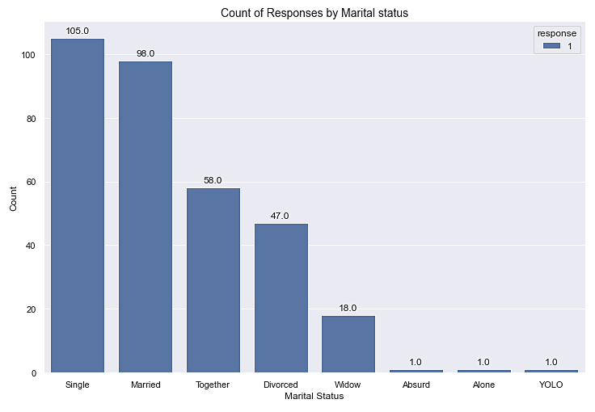

As observed, single people tend to accept more and people on absurd, alone or YOLO tend to be the least.

> Thus, the hypotheses are **FALSE**.

#### H5 The higher the income, the higher is the tendency to accept. (FALSE)

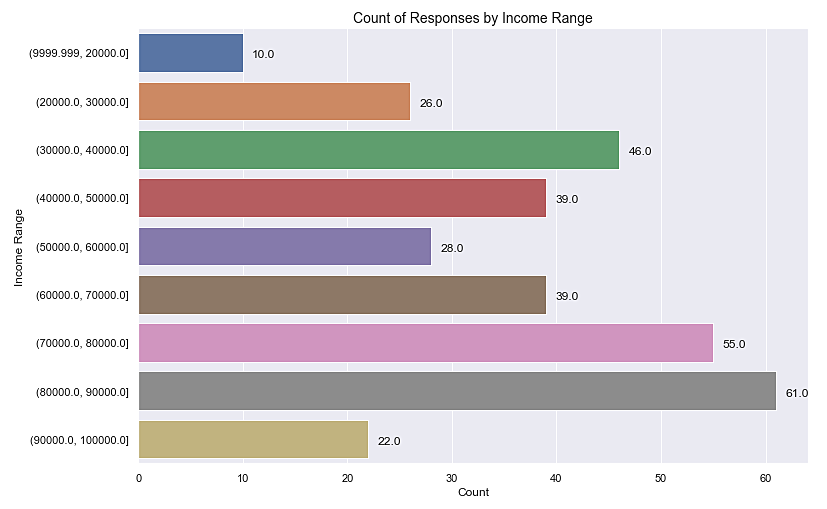

As observed, although the tendency to accept is higher among \$80k and $90k, it's not valid for all income levels.

> Thus, the hypothesis is **FALSE**

#### H6 People that have more teenagers tend to accept less. (TRUE)

#### H7 People that have more kids tend to accept less. (TRUE)

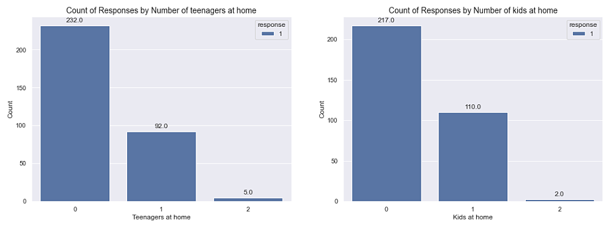

AS observed, the higher the number of kids, the lesser is the tendency to accept.

> Thus, the hypotheses are **TRUE**.

#### H13 The higher the number of visits to the web site, the higher is the tendency to accept. (FALSE)

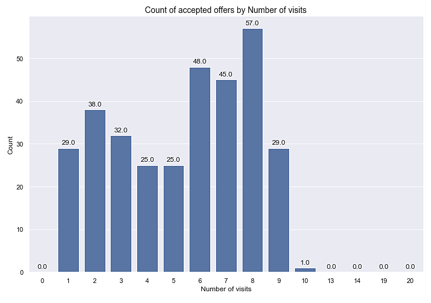

As observed, higher number of visits doesn't necessary means a higher tendency of offer acceptance.

> Thus, the hypothesis is **FALSE**.

 

#### Hypothesis summary

| ID  | Description                                                                                                                                          | Conclusion |
| :-: | :--------------------------------------------------------------------------------------------------------------------------------------------------- | :--------- |
| H1  | People with graduate degree tend to accept more                                                                                                      | True       |
| H2  | People with basic degree tend to be the least to accept                                                                                              | True       |
| H3  | People on YOLO tend to accept more                                                                                                                   | False      |
| H4  | People on divorced tend to be the least to accept                                                                                                    | False      |
| H5  | The higher the income, the higher is the tendency to accept                                                                                          | False      |
| H6  | People that have more teenagers tend to accept less                                                                                                  | True       |
| H7  | People that have more kids tend to accept less                                                                                                       | True       |
| H8  | People who complain tend to be the least to accept                                                                                                   | True       |
| H9  | The more recent a person enrolled the higher is the tendency to accept                                                                               | False      |
| H10 | The total amount spent in gold products by all people who accepted is larger than the total amount spent in gold products by all people that refused | False      |
| H11 | The total amount spent in products by all people who accepted is larger than the total amount spent in products by all people that refused           | False      |
| H12 | The total number of purchases by all people who accepted is larger than the total number of purchases by all people who refused                      | False      |
| H13 | The higher the number of visits to the web site, the higher is the tendency to accept                                                                | False      |
| H14 | The higher the number of days since the last purchase, the lower is the tendency to accept                                                           | True       |

 

### 3.1.3 Machine Learning

Tests were made using different algorithms.

#### Performance Metrics

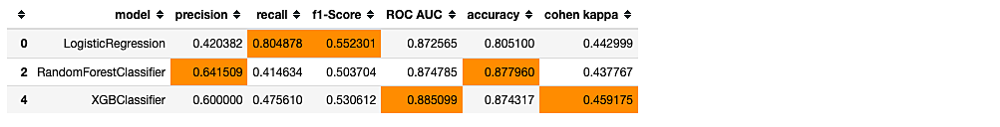

The <mark>**highlighted cells**</mark> correspond to the max value at each column.

#### Confusion Matrices

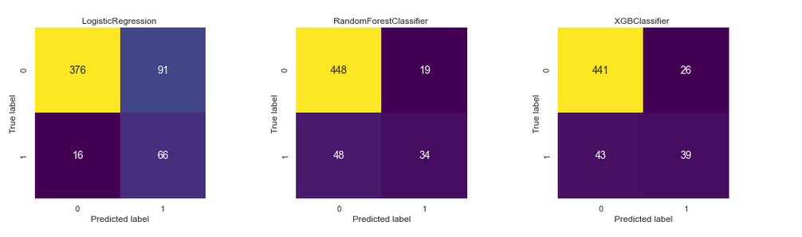

For our business and advertising bidding options, let's assume that we'll adopt the Cost-per-Action, that is, we'll only pay for our ad when someone converts (makes a purchase at our store). Thus, we need to check what is the **conversion rate** for each algorithm, that is, **from the total target users that we sent the ad, how many of them actually converted?**.

#### Convertion Rate = TP / (TP + FP)

| Algorithm                | Conversion Rate |
| :----------------------- | :-------------: |
| Logistic Regression      |     42\.04%     |
| Random Forest Classifier |     64\.15%     |
| XGB Classifier           |     60\.00%     |

As observed, the **Random Forest Classifier** presents provides a higher conversion rate. Thus, we'll choose it as the best model.

 

### 3.1.4 Business Performance

We'll consider that every customer expected to convert will spend an average amount on our products. In addition, let's consider the following advertising parameters:

- **Bidding option:** Cost-per-action (CPA) - You only pay for your ad when someone converts.
- **Medium**: Facebook Ads
- **Medium cost:** $5.47 per action

And additional scenario conditions:

- A given portfolio containing **549 targeted customers**.
- An **average amount** spent by each customer of **$566.72**.
- A **threshold of 0.50**.

The threshold is a ratio that says: _"What is the ratio of the targeted customers do I think that will convert?"_ For example, if you select a threshold of 0.45, you're supposing that 45% of the total targeted customers will convert. In addition, the other factor that we need to take into account is the conversion rate given by the model that will predict how likely each customer is prone to convert.

Then, the equation is:

### Total = (Number of Conversions x Average Amount) - (Number of Conversions x Medium Cost)

Thus, the **expected number of conversions** given by our model and taking into account the threshold is **249** resulting a **total expected revenue of $139,752.48**. This value was calculated considering the average amount that every customer expected to convert will spend on our products and the medium cost for every conversion.

 

### 3.1.5 Machine Learning Performance for the chosen algorithm

The final algorithm used in the web app is the **Random Forest Classifier with tuned hyperparameters and calibrated**.

#### Precision, Recall, ROC AUC and other metrics

These are the metrics obtained from the test set.

| precision | recall  | f1\-score | roc auc | cohen kappa | accuracy |
| --------- | ------- | --------- | ------- | ----------- | -------- |
| 0\.6458   | 0\.3780 | 0\.4769   | 0\.8699 | 0\.4121     | 0\.8761  |

 

The summary below shows the metrics comparison after running a cross validation score with stratified K-Fold with 10 splits in the full data set.

| Algorithm                                | avg precision             | avg recall                | avg roc auc               |
| ---------------------------------------- | ------------------------- | ------------------------- | ------------------------- |
| Random Forest                            | 0\.7122 \(\+/\- 0\.2658\) | 0\.3160 \(\+/\- 0\.1689\) | 0\.8845 \(\+/\- 0\.0680\) |
| Random Forest \(Tuned HP\)               | 0\.7256 \(\+/\- 0\.1572\) | 0\.3770 \(\+/\- 0\.2038\) | 0\.8972 \(\+/\- 0\.0614\) |
| Random Forest \(Tuned HP \+ Calibrated\) | 0\.6999 \(\+/\- 0\.1597\) | 0\.4134 \(\+/\- 0\.1736\) | 0\.8961 \(\+/\- 0\.0636\) |

As observed, although the Random Forest (Tunned HP) has a higher precision and ROC AUC, its probabilities aren't calibrated, so we're using the **Random Forest (Tuned HP + Calibrated)** in our web app because it's worth the trade-off between a little less precision, but a higher calibration quality.

 

# 4.0 Next Steps

**4.1** Help the Marketing team by presenting a set of clusters that represent each customer profile. The clusters will be developed by observing customer behavior and characteristics.

 

# References

- https://blog.marketo.com/
- https://www.marketo.com/digital-marketing/
- https://www.marketo.com/definitive-guides/digital-advertising/
- https://www.disruptiveadvertising.com/conversion-rate-optimization/conversion-rate/
- https://www.disruptiveadvertising.com/marketing/digital-marketing/

 

# Further reading

- https://www.wordstream.com/blog/ws/2017/07/05/online-advertising-costs
- https://youtu.be/09yi9S-f77c (How Much Does Digital Advertising REALLY Cost? [DATA] | WordStream)
- https://www.webfx.com/how-much-does-social-media-advertising-cost.html
- https://en.wikipedia.org/wiki/Data_management_platform
- https://en.wikipedia.org/wiki/Demand-side_platform
- https://en.wikipedia.org/wiki/Supply-side_platform
